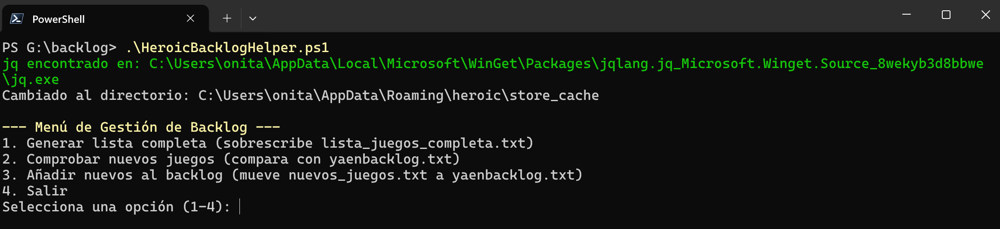

# 🎮 Heroic Games Launcher - Asistente de Backlog (PowerShell)

[](https://opensource.org/licenses/MIT)

Un script de PowerShell para extraer tus listas de juegos de las cachés de Heroic Games Launcher (Epic Games, GOG, Amazon Games) y ayudarte a mantener un archivo de texto simple con tu backlog.

## ✨ Características Principales

*   **Extracción Multi-Tienda:** Lee los archivos caché de Heroic para obtener listas de juegos de Epic, GOG y Amazon.
*   **Comparación Inteligente:** Compara la lista extraída con tu archivo de backlog (`yaenbacklog.txt`) para identificar juegos nuevos.
*   **Gestión Sencilla:** Genera un archivo (`nuevos_juegos.txt`) con los títulos nuevos y ofrece una opción para añadirlos fácilmente a tu backlog principal.
*   **Dependencia Externa:** Utiliza la potente herramienta `jq` para procesar los archivos JSON de caché de forma eficiente.
*   **Interfaz de Menú:** Fácil de usar a través de un menú interactivo en la consola PowerShell.
*   **Manejo de UTF-8:** Configurado para intentar manejar correctamente nombres de juegos con caracteres especiales.

## ⚙️ Requisitos Previos

1.  **Sistema Operativo:** Windows (ya que usa PowerShell).
2.  **PowerShell:** Versión 5.1 o superior (normalmente incluido en Windows 10/11).
3.  **Heroic Games Launcher:** Debes tenerlo instalado y haber iniciado sesión al menos una vez en las tiendas que quieras escanear (Epic, GOG, Amazon) para que existan los archivos de caché.
4.  **jq (¡Indispensable!):**
    *   Es una herramienta de línea de comandos para procesar JSON. El script **no funcionará** sin ella.
    *   **Descarga:** Ve a [https://jqlang.github.io/jq/download/](https://jqlang.github.io/jq/download/) y descarga el ejecutable para Windows (`jq-win64.exe` o similar).
    *   **Instalación (IMPORTANTE):**
        *   Renombra el archivo descargado a `jq.exe`.
        *   **Añade `jq.exe` al PATH del sistema:** Debes colocar `jq.exe` en una carpeta que esté incluida en la variable de entorno PATH de Windows, o añadir la carpeta donde lo guardes al PATH.
        *   *Forma fácil (recomendada):* Guarda `jq.exe` en una carpeta como `C:\Program Files\jq\` (créala si no existe) y luego añade esa carpeta al PATH del sistema (busca "Editar las variables de entorno del sistema" en Windows).
        *   *Alternativa:* Guarda `jq.exe` en la misma carpeta donde pongas el script de PowerShell. El script *podría* encontrarlo así, pero añadirlo al PATH es más robusto.
    *   **Verificación:** Abre una *nueva* ventana de PowerShell y escribe `jq --version`. Deberías ver la versión de `jq` instalada.

## 🚀 Instalación y Configuración

1.  **Descarga el Script:** Descarga el archivo `.ps1` (ej. `HeroicBacklogHelper.ps1`) de este repositorio. Guárdalo en una carpeta de tu elección.
2.  **(Opcional pero Recomendado) Instala `jq`:** Si aún no lo has hecho, sigue las instrucciones de la sección "Requisitos Previos" para instalar `jq` y añadirlo al PATH.
3.  **Configura el Directorio de Caché (SI ES NECESARIO):**
    *   El script asume que el directorio de caché de Heroic está en: `C:\Users\<TuUsuario>\AppData\Roaming\heroic\store_cache`.
    *   **Si tu instalación de Heroic está en otro lugar,** abre el archivo `.ps1` con un editor de texto (como Notepad++, VS Code, o incluso Bloc de notas) y **modifica la línea:**
        ```powershell
        $directorioHeroic = "C:\Users\<TuUsuario>\AppData\Roaming\heroic\store_cache" # cambia con tu nombre de usuario o directorio
        ```
        Reemplaza la ruta con la correcta para tu sistema. Guarda el archivo.
4.  **Crea tu Archivo de Backlog Inicial:**
    *   En la misma carpeta donde guardaste el script `.ps1`, crea un archivo de texto vacío llamado `yaenbacklog.txt`.
    *   Puedes hacerlo abriendo Bloc de notas, guardando un archivo vacío con ese nombre, o desde PowerShell con: `Set-Content -Path .\yaenbacklog.txt -Value "" -Encoding UTF8`.
    *   Este archivo almacenará la lista de juegos que ya has procesado/añadido a tu backlog.

## 📖 Uso

1.  **Abre PowerShell:**
    *   Navega hasta la carpeta donde guardaste el script `.ps1`. Puedes hacerlo con el comando `cd`:
        ```powershell
        cd "C:\Ruta\A\Tu\Carpeta\DelScript"
        ```
    *   *Truco:* En el Explorador de Windows, ve a la carpeta, mantén presionada la tecla `Shift`, haz clic derecho en un espacio vacío de la carpeta y selecciona "Abrir ventana de PowerShell aquí".
2.  **Ejecuta el Script:**
    *   Escribe `.\NombreDelScript.ps1` (ej. `.\HeroicBacklogHelper.ps1`) y presiona Enter.
    *   **Nota sobre Política de Ejecución:** Si recibes un error sobre la ejecución de scripts deshabilitada, puede que necesites ajustar la política de ejecución de PowerShell. Puedes permitir la ejecución de scripts locales firmados o todos los locales ejecutando PowerShell *como Administrador* y usando el comando:
        ```powershell
        # Opción 1: Permite scripts locales y remotos firmados (más seguro)
        Set-ExecutionPolicy RemoteSigned -Scope CurrentUser
        # Opción 2: Permite cualquier script local (menos seguro)
        # Set-ExecutionPolicy Unrestricted -Scope CurrentUser
        ```
        Responde 'S' (Sí) si te pregunta. Luego, cierra la ventana de Administrador y abre una ventana normal de PowerShell para ejecutar el script. [Más info sobre ExecutionPolicy](https://go.microsoft.com/fwlink/?LinkID=135170).
3.  **Usa el Menú:**
    *   El script te mostrará un menú con opciones:
        
    *   **Flujo Recomendado:**
        1.  **Opción 1 (`Generar lista completa`):** Ejecútala primero. Esto leerá los archivos `.json` de la caché de Heroic usando `jq` y creará/sobrescribirá `lista_juegos_completa.txt` con todos los juegos encontrados (formato: `NombreJuego<TAB>Tienda`).
        2.  **Opción 2 (`Comprobar nuevos juegos`):** Compara `lista_juegos_completa.txt` con tu `yaenbacklog.txt`. Si encuentra juegos en la lista completa que no están en tu backlog, los mostrará en pantalla y los guardará en `nuevos_juegos.txt`.
        3.  **Opción 3 (`Añadir nuevos al backlog`):** Si se generó `nuevos_juegos.txt` en el paso anterior, esta opción añadirá el contenido de `nuevos_juegos.txt` al final de tu `yaenbacklog.txt` y luego eliminará `nuevos_juegos.txt`.

**Archivos Generados/Utilizados:**

*   `lista_juegos_completa.txt`: Lista temporal extraída de Heroic (sobrescrita por Opción 1).
*   `yaenbacklog.txt`: **Tu archivo principal.** Contiene los juegos que ya has añadido. La Opción 3 añade contenido aquí. ¡Haz una copia de seguridad si es importante!
*   `nuevos_juegos.txt`: Lista temporal de juegos encontrados que no estaban en `yaenbacklog.txt` (creado por Opción 2, eliminado por Opción 3).

## ⚠️ Solución de Problemas Comunes

*   **Error "El comando 'jq' no se encuentra":** `jq` no está instalado o no está correctamente añadido a la variable de entorno PATH. Revisa los "Requisitos Previos".
*   **Error "El directorio especificado no existe":** La ruta en `$directorioHeroic` dentro del script no es correcta. Edita el script y pon la ruta correcta a tu carpeta `store_cache` de Heroic.
*   **Error de Ejecución de Scripts (Política de Ejecución):** Consulta la nota en la sección "Uso" sobre `Set-ExecutionPolicy`.
*   **No se encuentran juegos / Lista vacía:**
    *   Asegúrate de haber iniciado sesión en Heroic y que los archivos `.json` (ej. `legendary_library.json`) existen en la carpeta `store_cache`.
    *   Verifica que la ruta `$directorioHeroic` en el script sea correcta.
    *   Los filtros `jq` del script buscan juegos asociados a un `runner`. Si Heroic cambia la estructura del JSON, el script podría necesitar ajustes.
*   **Problemas con Nombres (Caracteres Raros):** El script intenta usar UTF-8, pero la consola de PowerShell a veces puede tener problemas. Si ves nombres extraños, verifica la codificación de los archivos `.txt` (deberían ser UTF-8).

## 📜 Licencia

Este proyecto se distribuye bajo la Licencia MIT. Consulta el archivo `LICENSE` para más detalles.

## 🙏 Agradecimientos

*   Al equipo de [Heroic Games Launcher](https://heroicgameslauncher.com/).
*   A Stephen Dolan y la comunidad por la herramienta [jq](https://jqlang.github.io/jq/).

## 👤 Autor

*   **rubocopter** - [rubocopter](https://github.com/rubocopter) 

---
*Gestionando el backlog, un script a la vez.*
